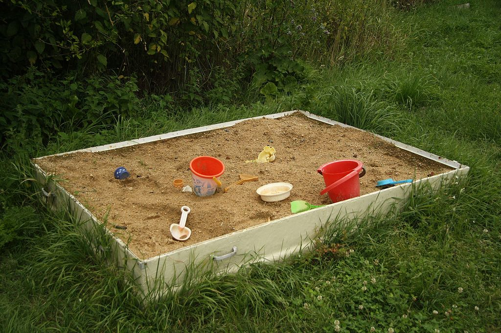

# Halmos Sandbox



Just a simple [forge](https://book.getfoundry.sh/forge/)-based repo for playing around with and
understanding solidity toy code.

Based on maurelian's [solidity-sandbox](https://github.com/maurelian/solidity-sandbox/tree/maurelian)

## Conventions

The whole purpose of this repo is to make it fast and easy to test stuff, and then keep the test code for
future reference. Specific test contracts and functions can be selected:

```sh
halmos --contract <contract-name>
halmos --function <function-name>
```

## Creating a new test

I don't want to have to think about avoiding contract naming collision, so each new test file
is prefixed with a number, and all the contract names in that file have that same number as a suffix.

There's now a script to generate a new file with a contract and an empty test function. Just run the following replacing `<test-name>` with the name of your test (file naming conventions apply, avoid spaces).  Or omit the test name to invoke _interactive mode_.

```sh
./newTest.sh <test-name>
```

## Yul code

Occasionally it's helpful to generate the Yul intermediate representation to understand what's
happening underneath the hood. In that case, I'll just use a command like the following to
put the IR into the `./ir` dir. Using a `.sol` extension gives pretty decent syntax highlighting
for readability.

```
forge inspect Target16 ir >! ir/bytesArgLenCheck16.yul.sol
```

Yul code can be compiled with `solc --strict-assembly`.


## Advanced Installation Tip
You can create a bash function that will change directories and call newTest.
Add it to your `.bashrc` file so you can call `scratch` from anywhere!

```bash
scratch() {
  cd <path to solidity-sandbox>
  bash newTest.sh $1
}
```
